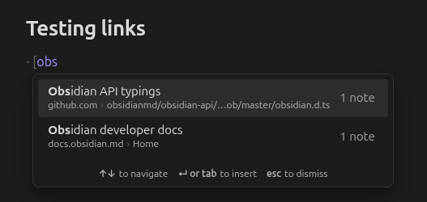

# External Link Autocomplete

Reuse the external links you've already written, without hunting for the URL again.

Start a Markdown link with `[` and type part of its text. External Link Autocomplete suggests matching links from anywhere in your vault, and accepting one inserts the whole link: type `[jira`, press Enter, and get `[Jira board](https://example.atlassian.net/…)`.

## Features

- **Suggestions from your own vault.** Every `[text](https://…)` link in your notes becomes a suggestion, keyed by its text.
- **Smart matching.** Exact matches come first, then matches at the start of the text (`[jira` → "Jira board"), then at the start of any word (`[board` → "Jira board"), then looser matches. Case and accents don't matter: `[cafe` finds "Café".
- **Sensible ranking.** Among equally good matches, links you use in more notes, and in notes you edited recently, come first.
- **Every URL a text has pointed to.** If "Docs" has linked to two different sites, you get a row for each, told apart by host and path.
- **Native look and feel.** The popup matches Obsidian's own suggestions and follows your theme.
- **Stays out of your way.** No suggestions inside `[[` wikilinks, `![` images, `[^` footnotes, `- [ ]` task boxes, code or frontmatter. Links are indexed in the background and kept up to date as you edit, rename and delete notes.
- **Desktop and mobile.** On mobile, tap a suggestion to insert it.

## Usage

1. In a note, type `[` followed by at least two characters of a link text you've used before.
2. Pick a suggestion with the arrow keys and press **Enter** or **Tab**, or click or tap it.
3. The full link is inserted, replacing what you typed (including an auto-paired `]`), and the cursor moves to just after it.

Press **Esc** to dismiss the suggestions. They stay closed until you start a new link.

## Settings

| Setting | What it does |
|---|---|
| Minimum characters | How many characters after `[` before suggestions appear. Default 2. |
| Ranking | Balanced (default), most used, or most recent. |
| When a text has several links | Show all (default), only the most recent, or only the most used. |
| Accept with tab | Tab inserts the selected suggestion, as Enter does. On by default. |
| Show note count | Shows how many notes use each link. |
| Ignored link texts | Texts that are never suggested. Defaults to here, link, this, source and click here. |
| Ignored domains | Domains that are never suggested. `*` matches anything, as in `*.internal.example.com`. |
| Excluded folders | Folders whose links are never suggested. |
| Rebuild index | Scans the vault again. Also available as the **Rebuild link index** command. |

## Privacy

Everything stays on your device. The plugin reads your notes to build an in-memory index of the links in them, and makes no network requests: no telemetry, no favicons, no page-title fetching.

## Installation

From Obsidian: open **Settings → Community plugins → Browse**, search for "External Link Autocomplete", then install and enable it.

Manually: download `main.js`, `manifest.json` and `styles.css` from the [latest release](https://github.com/brunoribeiro2k/obsidian-external-link-autocomplete/releases/latest) into `<your vault>/.obsidian/plugins/external-link-autocomplete/`, then enable the plugin under **Settings → Community plugins**.

Requires Obsidian 1.13 or later.

## Compatibility with other plugins

Obsidian shows one suggestion popup at a time. If another plugin also offers suggestions after a plain `[`, whichever plugin Obsidian asks first wins. External Link Autocomplete only claims a `[` when it has suggestions to show, so it never blocks another plugin otherwise.

## Contributing

Bug reports and ideas are welcome in [issues](https://github.com/brunoribeiro2k/obsidian-external-link-autocomplete/issues). For development, run `make` to list the commands; [`docs/design.md`](docs/design.md) describes how the plugin works.

## License

[MIT](LICENSE)
